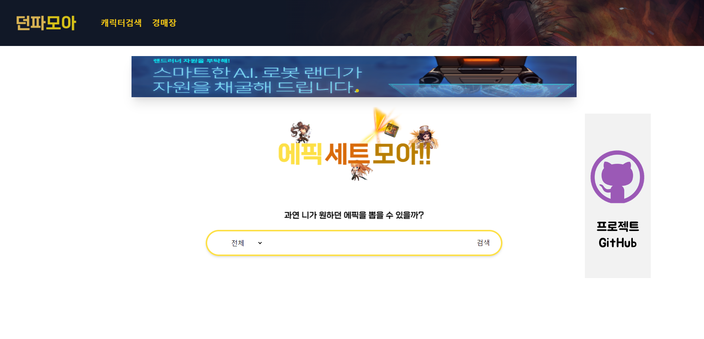
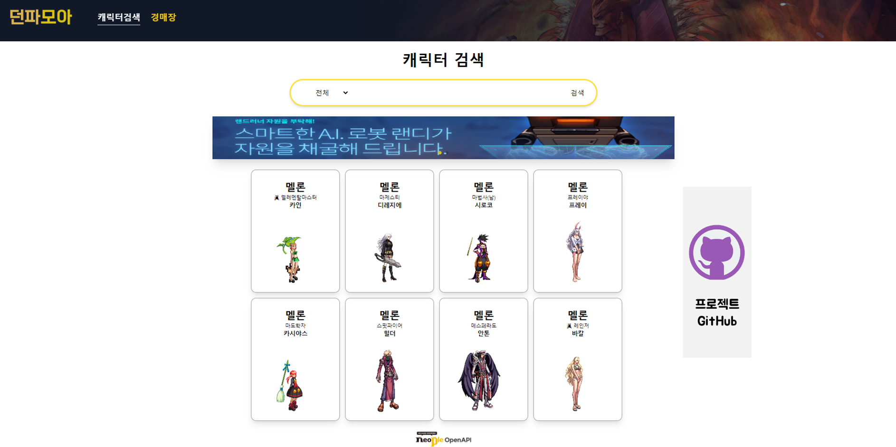

# **DNF API Search Site** - Team Project

## 🚀 **개요**

> 🚀 DNF API 를 **React** (TypeScript), **Tailwind,** **Node**(Express)를 이용하여 검색사이트를 구현 배포 하였습니다.

## 🚀**관련 사이트**

> **[FrontEnd(netlify) 배포](https://chimerical-genie-9befff.netlify.app/)**

> **[BackEnd(heroku) 배포](https://dnf-react-typescript.herokuapp.com/)**

> **[BackEnd(Github) 배포](https://github.com/easypage/DNF-react-typescript-server)**

---

## 🚀 **팀원**

### 😀 김병민

> 🚀 프론트엔드 & 백엔드 및 프로젝트 설계, 디자인, 코드구조 정리, 버그 수정.배포, README작성 등

### 😀 이승제

> 🚀 프론트엔드 REST API 기능 설계, 컴포넌트 코딩, 로고,아이콘등 에셋 제공, 주제선정 등

---

## 🚀 **프로젝트 진행순서**

> 🚀 **작업기간** : 2022-08-22 ~ 2022-09-28

1. 주제선정
2. 프로젝트설계(사용 기술 및 디자인(프레임 설계) 전반적인 기본틀 작성)
3. RESTAPI 설계및 기능구현
4. css 및 에셋 적용
5. 배너 이벤트 등 추가적인 기능구현
6. 배포 및 테스트

---

## 🚀 **프로젝트 구조**

#

> **readmeAssets** - **readme 작성시** 필요한 이미지가 있습니다.

---

> **src** - 기본적으로 프로젝트관련파일들은 여기 존재합니다.

#

> **asset** - **fonts,** **images,** 프로젝트에 사용되는 **ts 파일**이 존재합니다.

#

> **Components** - 컴포넌트를 **페이지이름폴더로** 정리, **프로젝트에 필요한 타입**들은 **types폴더**에 정리했습니다.

#

> **css** - tailwind로 처리하기 힘든 부분은 css파일로 만들어 처리하였습니다. 거기에 해당되는 css파일들이 존재합니다.

#

> **DesignPattern** - **자주 반복**되서 **사용**되는 컴포넌트들이 있는 폴더이빈다.

#

> **Page**, **Router** - **리액트 라우터 관련** 컴포넌트입니다.

## 🚀 **프로젝트 설명**

### 🛸 홈페이지(메인페이지)

> 🛸 개요 - 첫 접속 되면 보이는 페이지이며 **캐릭터 검색,** **프로젝트 깃허브이동,** **이벤트 배너(Swiper),** **헤더로** 구성되어있습니다.

> 🎨 디자인 - 메인페이지에선 헤더, 로고, 검색창같은 **필요한 ui** 만 만들어 간결함을 위주로 디자인하였으며 부족한 공간은 배너들로 채웠습니다.

> ⚙️ 기능 - 헤더의 **페이지 이동**, 이벤트배너이미지와 던전앤 파이터 이벤트 주소를 서버에서 받아와 던전앤파이터 **이벤트사이트로 바로이동**, **프로젝트 GITHUB광고,** 검색창을 이용하여 **캐릭터 검색 페이지로 이동**

> ⚙️ 기능 - 검색바에 값이 들어오지 않으면 이동하지 않습니다.

---

### 🛸 **캐릭터검색페이지**

---

> 🛸 개요 - 던전앤 파이터는 **서버마다 닉네임을 제한** 하기 때문에 자신의 캐릭터를 고르는 페이지 입니다.

---

> ⚙️ 기능 - 기본적으로 **데이터를 받아 올때** 에는 로딩이 되도록 설계하였습니다.

#

> 🎨 디자인 - 캐릭터카드에 커서를 올리면 **테두리 색상을 변경하여 가시성을** 증가 시켰습니다.

---

### 🛸 **캐릭터뷰페이지**

---

> 🛸 개요 - 캐릭터를 선택한 후 넘어가는 페이지이며 **캐릭터 배너,** **스테이터스,** **착용아이템** 을 나타냅니다.

> 🎨 디자인 - 재배치 할수 있도록 카드형식의 **컴포넌트 디자인** 을 하였으며, 서버별로 **배너의 배경이미지를 다르게** 표현하고 **스테이터스 아이콘,** **아이템 등급별 이름** 등으로 좀더 가시성을 좋게 만들었습니다.

#

> ⚙️ 기능 - 기본적으로 데이터를 받아 올때에는 로딩이 되도록 설계하였습니다.

### 🛸 **경매장페이지**

---

> 🛸 개요 - 던전앤 파이터 경매장 아이템 정보를 검색 해줍니다.

#

> 🎨 디자인 - 경매장의 경우 새로고침 보다는 아이템을 찾는 느낌을 주기위해 전체 페이지가아닌 **부분 로딩**을 구현하였습니다.

#

> 🎨 디자인 - 아이템을 검색하면 **테이블 리스트 형식**으로 보이게 하였습니다.

## **🍀 후기**

#

### 😀 김병민 - 팀프로젝트에서는 **코딩**보단 **주제선정,** **기술 스택 등**

### 팀원과의 **의사소통을 하는 부분**은 언제나 **중요**하다는 것을 **다시 생각**하게 되었고,

### 팀원의 **협조와 협동** 덕에 퀄리티가 생각만큼 뽑혀 꽤나 **보람찬 프로젝트**라고 느꼇습니다.

#

### 😀 이승제
